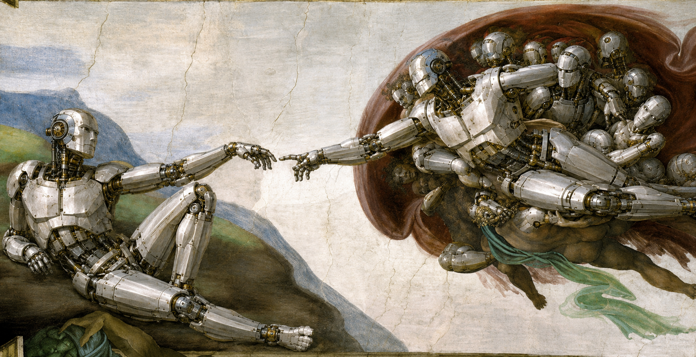

# Get Your MAE 162D/E Project Into The Gallery

**Isn't it beautiful!?** This gallery is the easiest way to make your capstone project visible to classmates,
instructors, future teams, and anyone who wants to understand what you built. Your
project page is generated from your own GitHub repository, so you do not need to
edit the gallery website directly.

You have two action items:

- [ ] Add a valid `manifest.json` at the root of your repository.
- [ ] Polish your root `README.md`, because that README becomes your project page.

## Action Item 1: Add `manifest.json`

Create a file named `manifest.json` in the top level of your repository. This file
is required. It gives the gallery enough structured information to list your team,
generate a unique project URL, show a thumbnail, and sanity-check that the repo is
for MAE 162D/E.

Use this shape:

```json
{
  "schema_version": 1,
  "course": "MAE 162D/E",
  "year": 2026,
  "section": "Yen",
  "group": 9,
  "title": "Example Capstone Portfolio",
  "authors": ["Toby Chen", "Small Kevin", "Big Will", "Jimmy", "Jason"],
  "summary": "A sample capstone portfolio that demonstrates how teams should fill in manifest.json and structure their README for the gallery.",
  "thumbnail": "assets/creation_of_robot.png",
  "keywords": ["SLAM", "LiDAR", "Goes very fast"]
}
```

Field notes:

| Field | What To Put |
| --- | --- |
| `schema_version` | Always `1`. |
| `course` | Always exactly `MAE 162D/E`. |
| `year` | Use `2026`. |
| `section` | Your instructor section, for example `Tsao` or `Yen`. |
| `group` | Your group number as a number, not a string. |
| `title` | The project name shown in the gallery. |
| `authors` | Team member names. |
| `summary` | One short factual sentence. The full writeup belongs in `README.md`. |
| `thumbnail` | A path relative to the repo root. |
| `keywords` | A few searchable terms for the project. |

After this file is inserted and pushed, Toby will scan the project repositories
and update the website periodically. When your repository is picked up, the
gallery caches your `manifest.json`, thumbnail image, and root `README.md`.
That cached README is what appears on your project page.

## Action Item 2: Polish `README.md`

Your root `README.md` is the real project page. Write it for a reader who was not
in your team meetings. A good README lets someone understand the problem, your
design choices, what worked, and how to reproduce or build on your work.

Use headings so the page is easy to skim:

```md
## Project Overview
## Problem
## Design And Approach
## Results
## How To Reproduce
## Team Contributions
## Links To More Detail
```

## Project Overview

Start with one short paragraph explaining what your team built and why it
matters. A reader should understand the project without opening any other file.

## Problem

Describe the engineering problem, constraints, and target users. Include enough
context for someone outside your team to understand the design choices.

## Design And Approach

Explain the main mechanical, electrical, software, and controls decisions. Use
short subsections if your project has multiple subsystems.

| Subsystem | What To Explain |
| --- | --- |
| Mechanical | Chassis, actuation, fabrication, mounting, tolerances. |
| Electrical | Sensors, power, wiring, custom boards, safety limits. |
| Software | Architecture, important algorithms, data flow, interfaces. |
| Testing | What you measured, how you validated it, and what changed. |

## Results

Summarize what worked, what did not work, and what you learned. Include numbers
when possible: speed, accuracy, load, runtime, latency, repeatability, or other
performance metrics.

## How To Reproduce

If another team or future student should be able to run your work, include the
minimum steps:

```sh
# Example only. Replace this with commands that apply to your project.
git clone <your-repo-url>
cd <your-repo>
```

Then describe hardware setup, required dependencies, calibration, and launch
commands.

## Team Contributions

List major responsibilities clearly.

| Member | Contributions |
| --- | --- |
| Toby Chen | Documentation, gallery integration, example project page. |
| Small Kevin | Mechanical design and validation. |
| Big Will | Controls, integration, and testing. |
| Jimmy | Software architecture and data flow. |
| Jason | Sensors, wiring, and debugging. |

## Add Images

Images make the page much easier to understand. Put image files in your repo,
then reference them with a relative path.

Markdown you type:

```md

```

Rendered result:


External images also work when you paste a full URL.

Markdown you type:

```md

```

Rendered result:


## Add Videos

For YouTube videos, the simplest option is to paste a YouTube URL on its own
line. GitHub will show it as a normal link, and our gallery will turn it into an
embedded video on your project page.

Markdown you type:

```md
https://www.youtube.com/watch?v=aDKdmlcwkyk
```

Rendered result:

https://www.youtube.com/watch?v=aDKdmlcwkyk

If you already have a YouTube embed iframe, you can paste the iframe HTML into
your README outside a code block. GitHub README pages do not render iframe
embeds, but our gallery will. The syntax looks like this:

```html
<iframe width="560" height="315" src="https://www.youtube.com/embed/aDKdmlcwkyk?si=80RuBlrg8V4FAhQz" title="YouTube video player" frameborder="0" allowfullscreen></iframe>
```

## Link To Internal Docs

It is fine for your root `README.md` to be an index. The gallery caches and
renders the root README, and that page can point readers to more detailed
documents, subfolder READMEs, PDFs, CAD notes, firmware notes, or test plans
inside your repo. Use relative links from the repo root.

This is useful when your project already has internal documentation. Keep the
root README readable, then link out to the deeper files that own each topic.

Examples from this repo:

- [Docs index](docs/README.md)
- [Mechanical notes](mechanical/README.md)
- [Firmware overview](firmware/README.md)
- [ROS 2 notes](docs/ros2/README.md)
- [Robot runtime README](ros2_ws/README.md)
- [Board specifications](nuevo_board/SPECIFICATIONS.md)

The gallery converts those relative links into GitHub links for your repository,
using the default branch of your repo. External links, such as links to
datasheets or documentation websites, work too.

## Writing Tips

- Keep the summary in `manifest.json` short.
- Put the real explanation in `README.md`.
- Prefer concrete results over broad claims.
- Use tables for comparisons and responsibilities.
- Use relative paths for repository files.
- Make sure the thumbnail path in `manifest.json` actually exists.
- Keep this README useful even if someone reads it outside the gallery.

## Markdown Tutorial

New to Markdown? Start here:

[GitHub for Beginners: Getting started with Markdown](https://github.blog/developer-skills/github/github-for-beginners-getting-started-with-markdown/)

GitHub's README page will show this tutorial video as a link. The gallery will
embed it:

https://www.youtube.com/watch?v=LxeclcePg-c

The GitHub guide covers the basics: headings, bold text, links, lists, code
blocks, images, tables, and task lists. Use it while editing this README.
